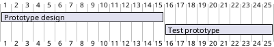
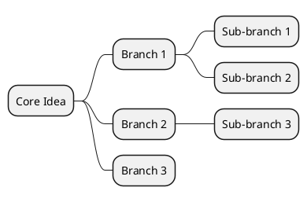
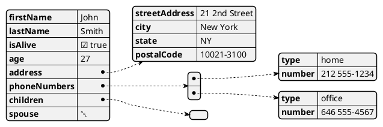
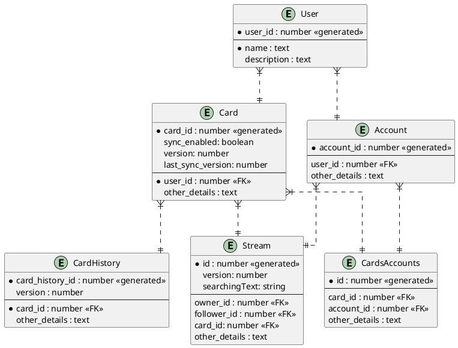

# Non-UML Examples with PlantUML

This document contains a collection of UML diagrams created using PlantUML.

### 1. Gantt Chart

This Gantt chart shows a simple project timeline with three tasks and their durations.

### 2. Mind Map 

This mind map represents a central idea with three branches and various sub-branches.

### 3. JSON 

### 4. Information Engineering Digram

