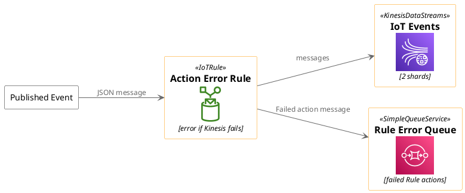
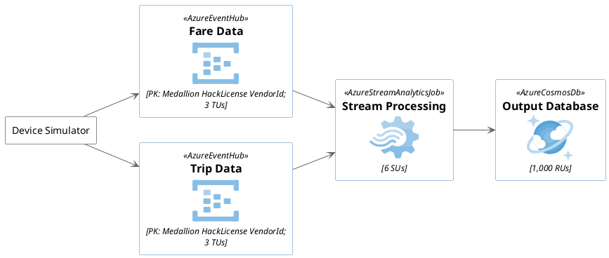
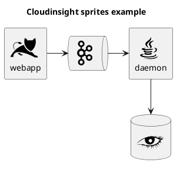

# Stdlib PlantUML examples

## 1. AWS Architecture Example (from stdlib)
# AWS Architecture Diagram Example

This example showcases a simple AWS architecture, including API Gateway, Lambda Function, DynamoDB, and S3.

## 2. Docker Architecture Diagram Example

## 3. Cloud Insight [cloudinsight]

