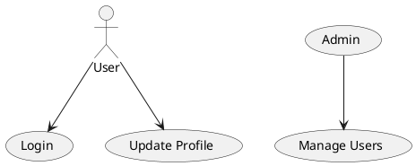
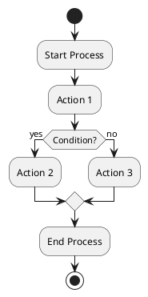

# UML Examples with PlantUML

This document contains a collection of UML diagrams created using PlantUML.

## 1. Sequence Diagram Example

```plantuml
Alice -> Bob: Authentication Request
Bob --> Alice: Authentication Response
Alice -> Bob: Another Request
Bob --> Alice: Another Response
```

This sequence diagram shows a simple interaction between Alice and Bob, where Alice sends an authentication request to Bob, and Bob responds.

## 2. Class Diagram Example
  
```plantuml
class User {
  +String name
  +String email
  +void login()
}

class Admin {
  +String role
  +void manageUsers()
}

User <|-- Admin
@enduml
```
This class diagram illustrates the relationship between a User class and an Admin class, where Admin inherits from User.

## 3. Use Case Diagram Example



This use case diagram shows the actions that a User and an Admin can perform within the system.

## 4. Component Diagram Example
```plantuml
[Frontend] --> [Backend]
[Backend] --> [Database]
```

This component diagram demonstrates the interaction between the Frontend, Backend, and Database components in a typical web application architecture.

## 5. Activity Diagram Example

This activity diagram shows a simple process flow with a decision point and two possible actions based on a condition.

## 6. State Diagram Example

```plantuml
[*] --> Idle
Idle --> Running : Start
Running --> Idle : Stop
Running --> Error : Error Occurred
Error --> Idle : Reset
```

This state diagram represents the states of a system (Idle, Running, Error) and the transitions between them.

### 7. Deployment Diagram Example
```plantuml
node "Client" {
  [Web Browser]
}

node "Server" {
  [Web Server] --> [Application Server]
  [Application Server] --> [Database Server]
}
```
This deployment diagram shows the deployment of a web application, including the Web Browser on the client side and the Web Server, Application Server, and Database Server on the server side.

## 8. Object Diagram Example
```plantuml
@startuml
object user {
  name = "John Doe"
  email = "john.doe@example.com"
}

object admin {
  name = "Jane Smith"
  role = "Administrator"
}
@enduml
This object diagram shows instances of user and admin objects with their attributes.


